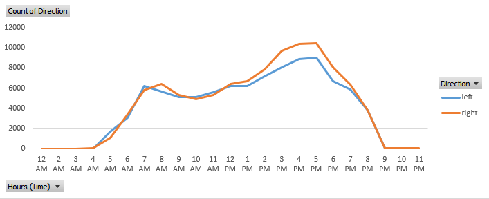
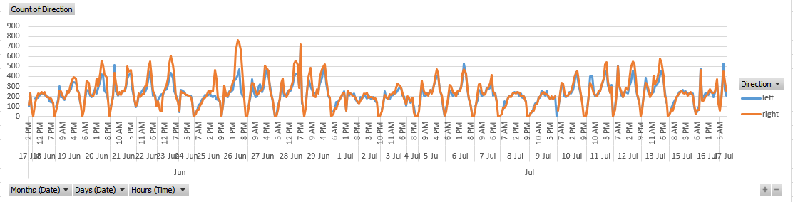

# Traffic Flow Analysis as of 7-17-23

## Main Findings

After analyzing one month of traffic flow data, I found that the traffic patterns exhibit typical rush hour peaks, with higher traffic volumes during 4-5 P.M.

## Hourly Traffic Flow

### Analysis

Looking at the average traffic flow throughout the day, not much is surprising, although it is pretty clear that traffic is more highly concentrated in the evening rush, whereas the morning rush is much more dispersed.

## Traffic Flow Across the Dataset

### Analysis

The entire dataset shows a couple things. First, and obviously, my camera doesn't detect cars at night, being that it has really poor night vision. Second, a few outliers stick out. Cars travelling right (east) on the 26th of June peaked at just short of 800 cars/hour from 3-6 P.M. Additionally, there were a few abnormally low days. A couple days in early July, the script stopped running dur to power outages, and other circumstances reuslting in my computer turning off. A bit unfortunate, but I will leave low-end outliers out for averaging calculations. 

## Stats

- Trimmean Average @ 20%: 6,968.24 cars per day, although selecting out outliers myself, I think a more realistic average is: 7,481.16 cars per day.
- The Trimmean Averages for left and right were 3,347.4 and 3,601.72 cars per day, respectively.
- Across the entire dataset, the model counted 196,262 cars, with 94,260 cars going left, and 102,002 cars going right.
  
## Raw Data

For a more detailed view of the data used for this analysis, you can access the raw data here:
[Raw Data](rawData5-19.csv)

---

