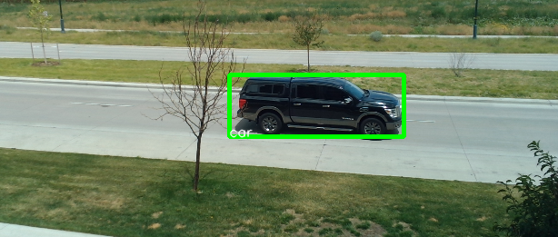
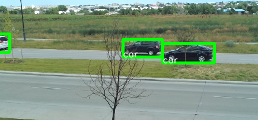

# Machine Learning Traffic Detection

This project uses TensorFlow with SSD MobileNet V2 FPNLite 320x320 to detect cars on a busy road outside an apartment. The detected cars are then streamed to an intermediate CSV file using Python. After the script stops each night, another function called process_csv recognizes and counts cars along with their directions, and saves the results to a final CSV file.

**[Data Report](media/7-17-Report.md)**

 

## Installation

To run this project, you need to install the following dependencies:

- OpenCV (`cv2`)
- NumPy (`numpy`)
- TensorFlow Lite (`tensorflow.lite`)
- Python CSV module (`csv`)
- Datetime (`datetime`)

You can install these dependencies using `pip`:

```shell
pip install opencv-python numpy tensorflow-lite datetime
```

## Usage

1. Clone the repository and navigate to the project directory.

2. Make sure you have the trained model file `detect.tflite` in the project directory.

3. Run the `main()` function in the Python script to start the car detection process:

```shell
python mainML.py
```

4. The webcam feed will open, and cars will be detected and highlighted in the video stream.

5. Press the `q` key to stop the car detection and close the video stream.

6. After the script stops, the car count and direction data will be processed and saved to a final CSV file named `final_data.csv`.

## Configuration

You can modify the following variables in the script according to your requirements:

- `CSV_FILE_PATH`: Specifies the path to the intermediate CSV file where car data is stored. (final csv can be changed in within the append_to_csv function.)

- `CAMERA_WIDTH` and `CAMERA_HEIGHT`: Set the desired dimensions for the video stream.

- `threshold`: Adjust the value to change the detection threshold for car detection. Increasing the threshold will result in fewer detections but with higher confidence.

## Output

The car detection script captures the video feed from the webcam and performs real-time car detection. Detected cars are highlighted with bounding boxes, and their class labels are displayed.

After the script stops, the car count and direction data are processed and saved to the `final_data.csv` file. The CSV file includes the following columns:

- `direction`: Indicates the direction of the car (left or right).

- `timestamp`: The timestamp when the car was detected.

- `date`: The date when the car was detected.

## Notes

- Ensure that the `detect.tflite` file is present in the project directory.

- The script uses the default webcam as the video source. If you have multiple cameras connected, you may need to modify the code to use the desired camera.

- Adjust the `threshold` value to optimize car detection based on your specific environment and requirements. (Probably not necessary!)

- The script may require additional permissions to access the webcam on certain systems. Make sure to grant the necessary permissions when prompted.

Feel free to customize and modify the code to suit your needs and incorporate additional functionalities as desired.

For any issues or questions, please feel free to contact me.
<harrison.getches@colorado.edu>
